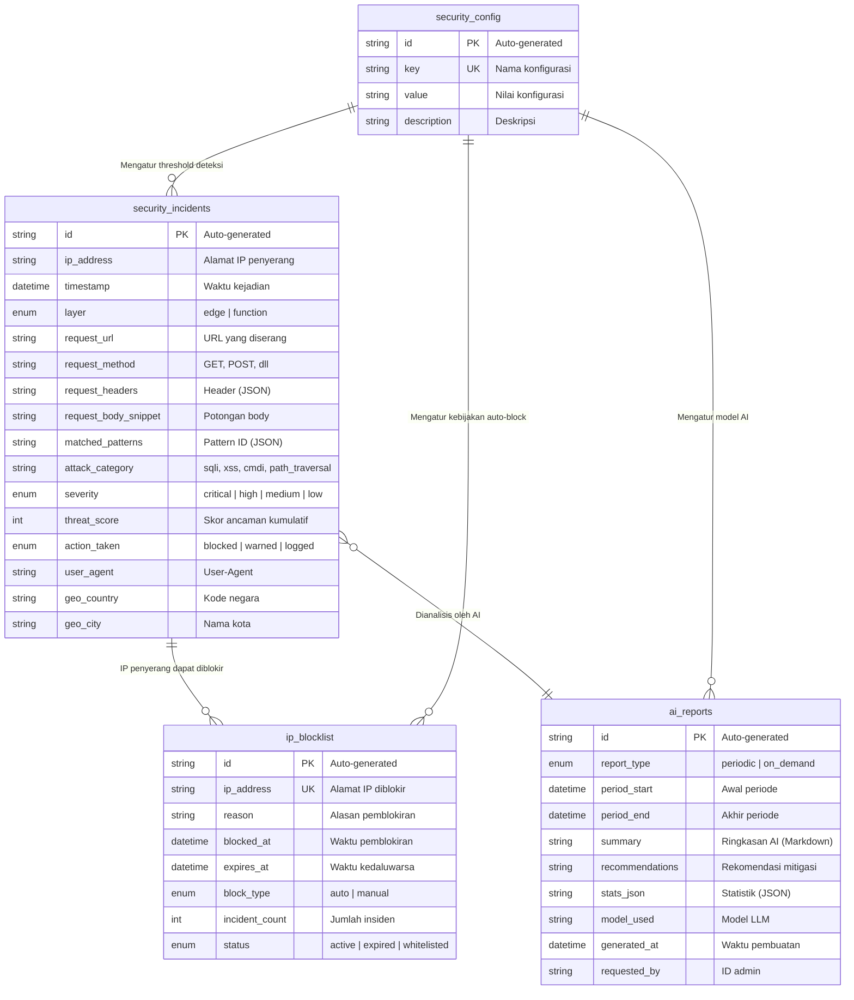
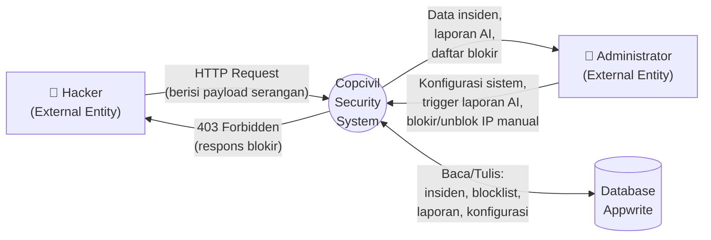
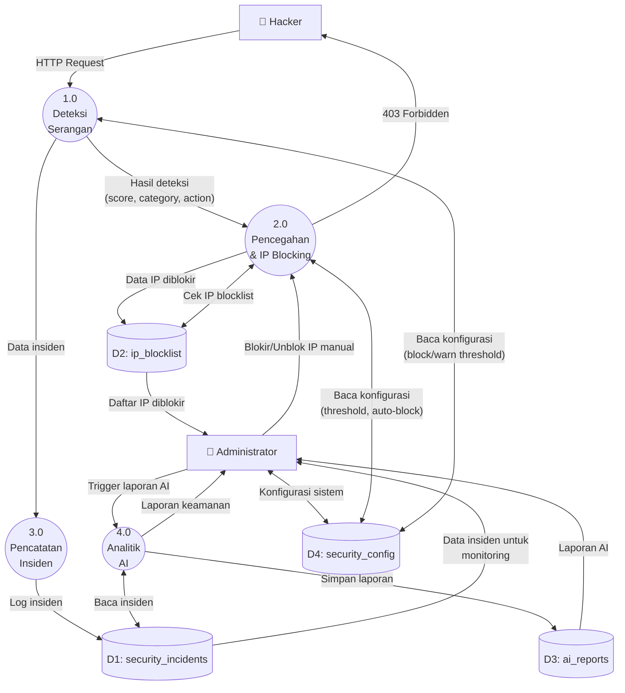
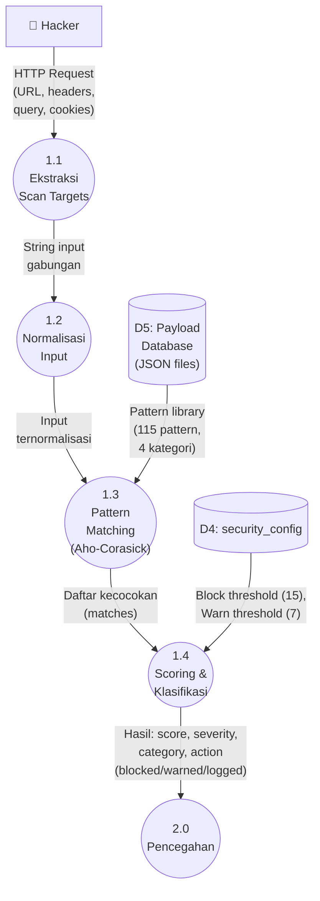
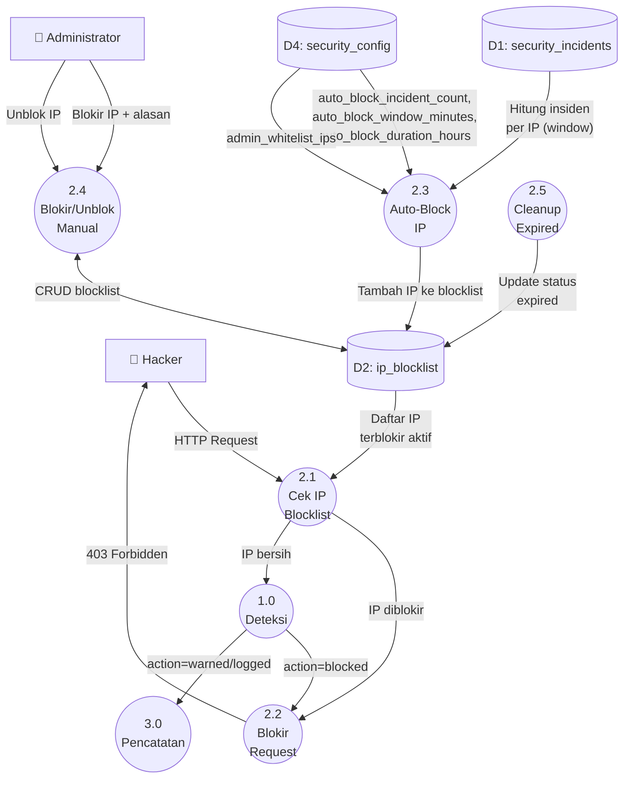
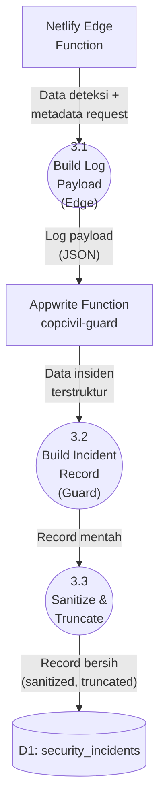
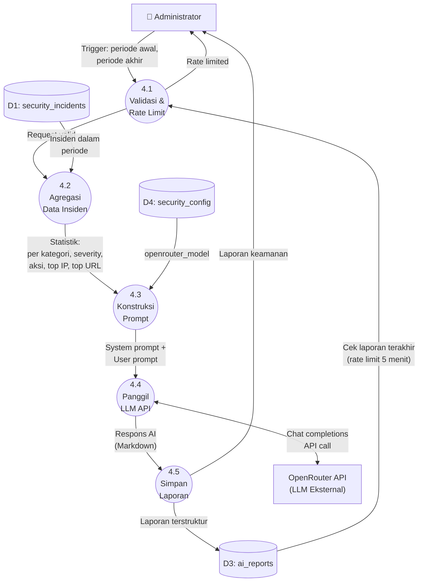

# ERD & DFD — Copcivil Security System

**Petunjuk penggunaan kode diagram:**

| Diagram | Tool yang Direkomendasikan | Cara Pakai |
|---|---|---|
| **ERD (DBML)** | [dbdiagram.io](https://dbdiagram.io) | Copy-paste kode DBML → otomatis muncul diagram |
| **ERD (Mermaid)** | [mermaid.live](https://mermaid.live) | Copy-paste kode Mermaid → otomatis muncul diagram |
| **DFD Level 0, 1, 2** | [draw.io / diagrams.net](https://app.diagrams.net) | Buat manual mengikuti deskripsi di bawah (DFD tidak didukung Mermaid secara native) |
| **DFD (alternatif)** | [mermaid.live](https://mermaid.live) | Gunakan kode flowchart Mermaid di bawah sebagai **pendekatan visual** |

> **Best practice untuk tesis**: Gunakan **dbdiagram.io** untuk ERD (hasilnya paling profesional), dan **draw.io** untuk DFD (karena DFD memiliki notasi khusus: proses = lingkaran, data store = garis paralel, external entity = kotak). Ekspor sebagai PNG resolusi tinggi (300 DPI) lalu sisipkan ke Word.

---

## 1. ENTITY RELATIONSHIP DIAGRAM (ERD)

### 1.1 ERD — Format DBML (untuk dbdiagram.io)

Buka https://dbdiagram.io → klik "Go to App" → paste kode berikut di panel kiri:

```dbml
// Copcivil Security System -- ERD
// Database: Appwrite Cloud (copcivil_security)

// === Enum definitions ===

Enum detection_layer {
  edge
  function
}

Enum severity_level {
  critical
  high
  medium
  low
}

Enum action_type {
  blocked
  warned
  logged
}

Enum block_type {
  auto
  manual
}

Enum block_status {
  active
  expired
  whitelisted
}

Enum report_type {
  periodic
  on_demand
}

// === Tables ===

Table security_incidents {
  id varchar(36) [pk, note: 'Auto-generated by Appwrite']
  ip_address varchar(45) [not null, note: 'Alamat IP penyerang']
  timestamp datetime [not null, note: 'Waktu kejadian serangan']
  layer detection_layer [not null, note: 'Layer deteksi (edge atau function)']
  request_url varchar(2048) [not null, note: 'URL yang diserang']
  request_method varchar(10) [not null, note: 'Metode HTTP (GET, POST, dll)']
  request_headers varchar(4096) [note: 'Header HTTP request (JSON string)']
  request_body_snippet varchar(2048) [note: 'Potongan body request']
  matched_patterns varchar(2048) [not null, note: 'ID pattern yang tercocok (JSON array)']
  attack_category varchar(50) [not null, note: 'Kategori: sqli, xss, cmdi, path_traversal']
  severity severity_level [not null, note: 'Tingkat keparahan']
  threat_score integer [not null, note: 'Skor ancaman (bobot kumulatif)']
  action_taken action_type [not null, note: 'Tindakan yang diambil']
  user_agent varchar(512) [note: 'User-Agent penyerang']
  geo_country varchar(2) [note: 'Kode negara (jika tersedia)']
  geo_city varchar(100) [note: 'Nama kota (jika tersedia)']

  indexes {
    ip_address [name: 'idx_ip_address']
    timestamp [name: 'idx_timestamp']
    attack_category [name: 'idx_attack_category']
    severity [name: 'idx_severity']
    action_taken [name: 'idx_action_taken']
  }
}

Table ip_blocklist {
  id varchar(36) [pk, note: 'Auto-generated by Appwrite']
  ip_address varchar(45) [not null, unique, note: 'Alamat IP yang diblokir']
  reason varchar(500) [not null, note: 'Alasan pemblokiran']
  blocked_at datetime [not null, note: 'Waktu pemblokiran']
  expires_at datetime [note: 'Waktu kedaluwarsa (null = permanen)']
  block_type block_type [not null, note: 'Jenis blokir: otomatis atau manual']
  incident_count integer [not null, note: 'Jumlah insiden yang memicu pemblokiran']
  status block_status [not null, note: 'Status pemblokiran']

  indexes {
    ip_address [unique, name: 'idx_ip_unique']
    status [name: 'idx_status']
    expires_at [name: 'idx_expires']
  }
}

Table ai_reports {
  id varchar(36) [pk, note: 'Auto-generated by Appwrite']
  report_type report_type [not null, note: 'Jenis laporan']
  period_start datetime [not null, note: 'Awal periode analisis']
  period_end datetime [not null, note: 'Akhir periode analisis']
  summary varchar(10000) [not null, note: 'Ringkasan analisis AI (Markdown)']
  recommendations varchar(5000) [note: 'Rekomendasi mitigasi dari AI']
  stats_json varchar(5000) [not null, note: 'Statistik insiden (JSON)']
  model_used varchar(100) [not null, note: 'Model LLM yang digunakan']
  generated_at datetime [not null, note: 'Waktu pembuatan laporan']
  requested_by varchar(36) [note: 'ID admin yang meminta (null = periodik)']

  indexes {
    generated_at [name: 'idx_generated_at']
  }
}

Table security_config {
  id varchar(36) [pk, note: 'Auto-generated by Appwrite']
  config_key varchar(50) [not null, unique, note: 'Nama konfigurasi']
  config_value varchar(2000) [not null, note: 'Nilai konfigurasi']
  description varchar(200) [note: 'Deskripsi konfigurasi']

  indexes {
    config_key [unique, name: 'idx_key']
  }
}

// === Relationships ===
// Relasi implisit (Appwrite NoSQL -- tidak ada foreign key formal)
// ip_address digunakan sebagai penghubung logis antar koleksi

Ref: security_incidents.ip_address > ip_blocklist.ip_address
```

### 1.2 ERD — Format Mermaid (untuk mermaid.live)

Buka https://mermaid.live → paste kode berikut:



### 1.3 Penjelasan ERD untuk Tesis

ERD ini menggambarkan struktur basis data Copcivil Security System yang diimplementasikan menggunakan Appwrite Cloud. Basis data `copcivil_security` terdiri dari empat koleksi utama:

1. **security_incidents** — Menyimpan setiap insiden keamanan yang terdeteksi, meliputi informasi IP penyerang, waktu kejadian, URL yang diserang, kategori serangan, skor ancaman, dan tindakan yang diambil. Koleksi ini merupakan inti pencatatan sistem dengan 15 atribut.

2. **ip_blocklist** — Mengelola daftar alamat IP yang diblokir, baik secara otomatis (berdasarkan ambang batas insiden) maupun manual (oleh administrator). Setiap entri mencatat alasan pemblokiran, waktu kedaluwarsa, dan status aktif.

3. **ai_reports** — Menyimpan laporan analisis keamanan yang dihasilkan oleh AI/LLM. Setiap laporan berisi ringkasan eksekutif, rekomendasi mitigasi, statistik insiden, serta metadata model AI yang digunakan.

4. **security_config** — Menyimpan konfigurasi sistem yang dapat diubah oleh administrator, seperti ambang batas pemblokiran, durasi auto-block, model AI, dan daftar IP whitelist.

Relasi antar koleksi bersifat implisit (Appwrite menggunakan arsitektur NoSQL tanpa foreign key formal). Atribut `ip_address` pada `security_incidents` terhubung secara logis dengan `ip_blocklist`, sedangkan `ai_reports` menganalisis data dari `security_incidents` berdasarkan rentang waktu (`period_start` dan `period_end`).

---

## 2. DATA FLOW DIAGRAM (DFD)

### 2.1 DFD Level 0 — Diagram Konteks

**Petunjuk draw.io**: Buat diagram baru → gunakan bentuk berikut:
- **Kotak persegi** = External Entity (Hacker, Administrator)
- **Lingkaran/oval** = Process (Copcivil Security System)
- **Garis paralel** = Data Store (Database Appwrite)
- **Panah** = Aliran data



**Deskripsi DFD Level 0:**
Diagram konteks menunjukkan interaksi antara dua entitas eksternal dengan Copcivil Security System. **Hacker** mengirimkan HTTP request yang berpotensi mengandung payload serangan ke sistem. Sistem memproses request tersebut dan mengembalikan respons blokir (403 Forbidden) jika terdeteksi berbahaya. **Administrator** berinteraksi dengan sistem melalui dashboard admin untuk memonitor insiden, mengelola daftar blokir IP, men-trigger analisis AI, dan mengkonfigurasi parameter sistem. Seluruh data disimpan di **Database Appwrite** yang mencakup insiden keamanan, daftar blokir IP, laporan AI, dan konfigurasi sistem.

---

### 2.2 DFD Level 1



**Deskripsi DFD Level 1:**
DFD Level 1 merinci Copcivil Security System menjadi empat proses utama:

1. **Proses 1.0 — Deteksi Serangan**: Menerima HTTP request dari Hacker, mengekstrak scan targets (URL path, query parameters, cookies, header), lalu menjalankan normalisasi input dan pattern matching Aho-Corasick. Menghasilkan hasil deteksi berupa skor ancaman, kategori serangan, dan aksi yang harus diambil.

2. **Proses 2.0 — Pencegahan & IP Blocking**: Memeriksa apakah IP pengirim request terdaftar di blocklist. Jika IP sudah diblokir, langsung mengembalikan respons 403. Jika deteksi menghasilkan aksi "blocked", IP ditolak. Sistem juga mengelola auto-blocking berdasarkan jumlah insiden dalam jendela waktu tertentu, serta menerima perintah blokir/unblok manual dari Administrator.

3. **Proses 3.0 — Pencatatan Insiden**: Mencatat setiap insiden keamanan yang terdeteksi (baik yang diblokir maupun diperingatkan) ke koleksi `security_incidents` di Appwrite secara asinkron.

4. **Proses 4.0 — Analitik AI**: Menerima trigger dari Administrator, mengambil data insiden dari database, mengagregasi statistik, lalu mengirimkan prompt ke LLM eksternal (via OpenRouter API) untuk menghasilkan laporan analisis keamanan yang disimpan di koleksi `ai_reports`.

---

### 2.3 DFD Level 2 — Proses 1.0 (Deteksi Serangan)



**Deskripsi:**
Proses deteksi serangan terdiri dari empat sub-proses berurutan:

- **1.1 Ekstraksi Scan Targets**: Mengekstrak seluruh komponen input dari HTTP request — URL pathname, query parameters, cookies, dan header referer — lalu menggabungkannya menjadi satu string input untuk dipindai.

- **1.2 Normalisasi Input**: Menjalankan pipeline normalisasi 6 tahap: (1) penghapusan null bytes, (2) double URL decoding, (3) HTML entity decoding, (4) case folding (lowercase), (5) penghapusan komentar SQL, (6) normalisasi whitespace.

- **1.3 Pattern Matching Aho-Corasick**: Input yang telah dinormalisasi dipindai menggunakan Aho-Corasick automaton yang telah dibangun dari 115 pola serangan dalam 4 kategori (SQLi, XSS, CMDi, Path Traversal). Automaton melakukan pencarian dalam O(n) per request.

- **1.4 Scoring & Klasifikasi**: Setiap kecocokan pattern diberi bobot berdasarkan severity (critical=10, high=7, medium=4, low=1). Skor kumulatif menentukan aksi: `blocked` (≥15), `warned` (≥7), atau `logged` (<7).

---

### 2.4 DFD Level 2 — Proses 2.0 (Pencegahan & IP Blocking)



**Deskripsi:**
Proses pencegahan terdiri dari lima sub-proses:

- **2.1 Cek IP Blocklist**: Setiap request masuk diperiksa terhadap cache blocklist yang di-refresh setiap 5 menit dari database Appwrite. Jika IP terdaftar sebagai "active", request langsung ditolak tanpa melalui proses deteksi.

- **2.2 Blokir Request**: Membuat dan mengembalikan respons 403 Forbidden (format JSON dengan header `X-Copcivil-Blocked: true`) kepada Hacker.

- **2.3 Auto-Block IP**: Setelah insiden dicatat, sistem menghitung jumlah insiden dari IP yang sama dalam jendela waktu tertentu (default: 10 menit). Jika melebihi ambang batas (default: 5 insiden), IP secara otomatis diblokir selama durasi yang dikonfigurasi (default: 24 jam). IP yang terdaftar di whitelist dikecualikan dari auto-block.

- **2.4 Blokir/Unblok Manual**: Administrator dapat memblokir IP secara manual dengan menyertakan alasan, atau membuka blokir IP melalui dashboard admin.

- **2.5 Cleanup Expired**: Proses pembersihan yang mengubah status IP yang telah melewati masa kedaluwarsa dari "active" menjadi "expired".

---

### 2.5 DFD Level 2 — Proses 3.0 (Pencatatan Insiden)



**Deskripsi:**
- **3.1 Build Log Payload (Edge)**: Edge function membangun payload log yang berisi IP, URL, metode HTTP, user agent, dan hasil deteksi, lalu mengirimkan secara asinkron (fire-and-forget) ke Appwrite Function `copcivil-guard`.

- **3.2 Build Incident Record (Guard)**: Fungsi guard menerima payload dan menyusun record insiden lengkap dengan 15 field sesuai skema koleksi `security_incidents`.

- **3.3 Sanitize & Truncate**: Setiap field disanitasi (penghapusan karakter kontrol) dan dipotong sesuai batas ukuran kolom Appwrite untuk memastikan data tersimpan dengan aman.

---

### 2.6 DFD Level 2 — Proses 4.0 (Analitik AI)



**Deskripsi:**
- **4.1 Validasi & Rate Limit**: Memvalidasi permintaan laporan (periode wajib diisi) dan memeriksa rate limit (maksimal 1 laporan per 5 menit) untuk mencegah penyalahgunaan.

- **4.2 Agregasi Data Insiden**: Mengambil seluruh insiden dalam periode yang diminta dari database, lalu mengagregasi menjadi statistik: total insiden, distribusi per kategori serangan, per severity, per aksi, 10 IP teratas, 10 URL target teratas, dan rata-rata skor ancaman.

- **4.3 Konstruksi Prompt**: Membangun prompt terstruktur yang terdiri dari system prompt (instruksi analis keamanan siber) dan user prompt (data statistik insiden dalam format Markdown) untuk dikirim ke LLM.

- **4.4 Panggil LLM API**: Mengirimkan prompt ke OpenRouter API menggunakan model yang dikonfigurasi (default: `anthropic/claude-sonnet-4`). Respons AI berisi analisis pola, penilaian risiko, dan rekomendasi.

- **4.5 Simpan Laporan**: Respons AI diparsing menjadi laporan terstruktur (ringkasan, rekomendasi, statistik JSON) lalu disimpan ke koleksi `ai_reports` di Appwrite.

---

## 3. CATATAN PENTING

### Perbedaan dengan ERD/DFD Tesis Lama
| Aspek | Tesis Lama | Projek Aktual |
|---|---|---|
| Nama sistem | Aspri Cyber / Xpecto Shield | Copcivil Security System |
| Entitas DB | Tidak terdefinisi jelas (hacker, admin, vulnerability, payload, detection_engine) | 4 koleksi Appwrite (security_incidents, ip_blocklist, ai_reports, security_config) |
| Layer deteksi | Next.js Middleware (tunggal) | 2 layer: Netlify Edge Function + Appwrite Function |
| Kategori serangan | 5 (SQLi, XSS, Path Traversal, SSRF, LFI) | 4 (SQLi, XSS, CMDi, Path Traversal) |
| External API | Tidak jelas | OpenRouter API (LLM provider-agnostic) |
| DFD proses | Celah Keamanan, Pencegahan Exploitasi, Mitigasi, Analitik AI | Deteksi Serangan, Pencegahan & IP Blocking, Pencatatan Insiden, Analitik AI |

### Tips Membuat Diagram di draw.io
1. Buka https://app.diagrams.net
2. Pilih "Create New Diagram" → pilih template "Blank Diagram"
3. Gunakan shape library:
   - **Rectangle** (kotak) untuk External Entity
   - **Ellipse** (oval/lingkaran) untuk Process — tulis nomor proses di dalam
   - **Open-ended rectangle** (garis paralel terbuka) untuk Data Store — tulis D1, D2, dst.
   - **Arrow** (panah) untuk aliran data — tulis label di atas panah
4. Ekspor: File → Export as → PNG (300 DPI) atau SVG
5. Sisipkan ke dokumen Word
