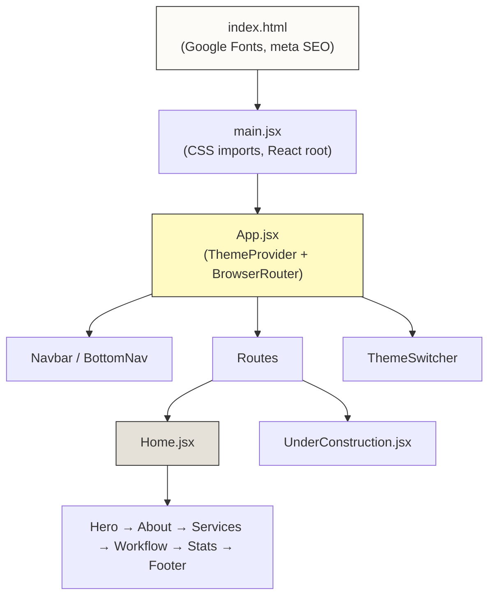

# PLN COP Civil UPT Malang — Walkthrough & Future Roadmap

## ✅ Phase 1: Static Landing Page (SELESAI)

### Apa yang sudah dibangun

| Komponen | Status | File |
|---|---|---|
| Vite + React SPA | ✅ | [vite.config.js](file:///home/ragel/Documents/projek-c/projek-mas-riski/vite.config.js), [package.json](file:///home/ragel/Documents/projek-c/projek-mas-riski/package.json) |
| Design Token System (3 tema) | ✅ | [tokens.css](file:///home/ragel/Documents/projek-c/projek-mas-riski/src/styles/tokens.css) |
| CSS Reset & Typography | ✅ | [base.css](file:///home/ragel/Documents/projek-c/projek-mas-riski/src/styles/base.css) |
| Component Styles | ✅ | [components.css](file:///home/ragel/Documents/projek-c/projek-mas-riski/src/styles/components.css) |
| Layout System (Responsive) | ✅ | [layouts.css](file:///home/ragel/Documents/projek-c/projek-mas-riski/src/styles/layouts.css) |
| Hand-Drawn Theme | ✅ | [hand-drawn.css](file:///home/ragel/Documents/projek-c/projek-mas-riski/src/styles/themes/hand-drawn.css) |
| Neo-Brutalism Theme | ✅ | [neo-brutalism.css](file:///home/ragel/Documents/projek-c/projek-mas-riski/src/styles/themes/neo-brutalism.css) |
| Playful Geometric Theme | ✅ | [playful-geometric.css](file:///home/ragel/Documents/projek-c/projek-mas-riski/src/styles/themes/playful-geometric.css) |
| Theme Context + Persistence | ✅ | [ThemeContext.jsx](file:///home/ragel/Documents/projek-c/projek-mas-riski/src/context/ThemeContext.jsx) |
| Navbar (Desktop) | ✅ | [Navbar.jsx](file:///home/ragel/Documents/projek-c/projek-mas-riski/src/components/Navbar.jsx) |
| Bottom Nav (Mobile) | ✅ | [BottomNav.jsx](file:///home/ragel/Documents/projek-c/projek-mas-riski/src/components/BottomNav.jsx) |
| Theme Switcher | ✅ | [ThemeSwitcher.jsx](file:///home/ragel/Documents/projek-c/projek-mas-riski/src/components/ThemeSwitcher.jsx) |
| Hero, About, Services | ✅ | [Hero.jsx](file:///home/ragel/Documents/projek-c/projek-mas-riski/src/components/Hero.jsx), [About.jsx](file:///home/ragel/Documents/projek-c/projek-mas-riski/src/components/About.jsx), [Services.jsx](file:///home/ragel/Documents/projek-c/projek-mas-riski/src/components/Services.jsx) |
| Workflow, Stats, Footer | ✅ | [Workflow.jsx](file:///home/ragel/Documents/projek-c/projek-mas-riski/src/components/Workflow.jsx), [Stats.jsx](file:///home/ragel/Documents/projek-c/projek-mas-riski/src/components/Stats.jsx), [Footer.jsx](file:///home/ragel/Documents/projek-c/projek-mas-riski/src/components/Footer.jsx) |
| Under Construction Pages | ✅ | [UnderConstruction.jsx](file:///home/ragel/Documents/projek-c/projek-mas-riski/src/components/UnderConstruction.jsx) |
| Home Page Assembly | ✅ | [Home.jsx](file:///home/ragel/Documents/projek-c/projek-mas-riski/src/pages/Home.jsx) |
| App Shell + Routing | ✅ | [App.jsx](file:///home/ragel/Documents/projek-c/projek-mas-riski/src/App.jsx) |

### Arsitektur



### Cara menjalankan

```bash
# Dev server
npm run dev

# Production build
npm run build
```

### Validasi
- ✅ `npm run build` sukses — 24KB CSS, 250KB JS (79KB gzip)
- ✅ Semua 10 komponen + 4 CSS + 3 theme CSS terbuat sesuai spec
- ✅ 4 routes: `/`, `/panduan`, `/pekerjaan-beton`, `/qna`

---

## 🗺️ Roadmap Tahapan Selanjutnya

Berikut fase-fase pengembangan ke depan berdasarkan kebutuhan hybrid website (public landing + internal SOP portal):

### Phase 2: Appwrite Backend Setup & Authentication

> [!IMPORTANT]
> Ini adalah fase kritis karena memungkinkan pemisahan konten publik vs. internal.

**Scope:**
- Setup Appwrite project (cloud atau self-hosted)
- Implementasi auth: login/logout, session management
- Dua role: **Admin** (kelola konten) dan **User Biasa** (akses SOP/panduan)
- Protected routes — redirect ke login jika belum authenticated
- Halaman login/register dengan desain yang sesuai tema aktif

**File baru:**
- `src/lib/appwrite.js` — Appwrite SDK client configuration
- `src/context/AuthContext.jsx` — Auth state management
- `src/components/ProtectedRoute.jsx` — Route guard
- `src/pages/Login.jsx`, `src/pages/Register.jsx`
- `src/components/UserMenu.jsx` — Replace "Masuk" button setelah login

---

### Phase 3: Halaman Panduan (SOP Content)

**Scope:**
- Halaman `/panduan` berisi daftar panduan/SOP untuk pekerjaan sipil
- Konten diambil dari Appwrite Database
- Struktur: Kategori → Sub-kategori → Detail dokumen
- Search dan filter berdasarkan kategori
- Download file attachment (PDF, gambar)

**Konten yang sudah tersedia** (dari ITP Pekerjaan Sipil.docx):
- 9 kategori inspeksi material (agregat, semen, besi, bolt, air, dll)
- Tabel-tabel referensi teknis

---

### Phase 4: Halaman Pekerjaan Beton

**Scope:**
- Halaman `/pekerjaan-beton` berisi panduan detail inspeksi beton
- Konten dari ITP: 5 jenis struktur (Pondasi, Sloof, Kolom, Balok, Plat Lantai)
- Alur 3 fase (Pra-cor → Saat cor → Pasca-cor) dengan checklist interaktif
- Tabel referensi: slump value, ukuran agregat, mix design
- Foto dokumentasi per tahapan (upload via Appwrite Storage)

---

### Phase 5: Halaman Q&A / Forum

**Scope:**
- Halaman `/qna` berisi forum tanya-jawab internal
- User bisa buat pertanyaan, jawab, dan vote
- Admin bisa pin jawaban terbaik
- Kategori: Beton, Material, Prosedur, Umum
- Appwrite Realtime untuk notifikasi jawaban baru

---

### Phase 6: Admin Dashboard

**Scope:**
- Halaman `/admin` (khusus role Admin)
- CRUD konten Panduan dan Pekerjaan Beton
- Markdown editor untuk konten
- Upload dan kelola file/gambar
- Kelola user (activate/deactivate)
- Analytics sederhana (jumlah views per panduan)

---

### Phase 7: Polish & Deployment

**Scope:**
- Pilih 1 tema final (setelah review semua tema)
- PWA support (offline access untuk SOP di lapangan)
- SEO optimization lanjutan
- Deploy ke hosting (Vercel/Netlify untuk frontend, Appwrite Cloud untuk backend)
- Custom domain

---

## 💬 Pertanyaan untuk Diskusi

> [!NOTE]
> Fase-fase di atas adalah rekomendasi. Beberapa pertanyaan yang perlu diputuskan:

1. **Appwrite:** Apakah akan self-hosted atau menggunakan Appwrite Cloud? Self-hosted memberi kontrol penuh tapi butuh server. Cloud lebih mudah di-setup.

2. **Prioritas fase:** Apakah ingin mulai dari Phase 2 (Auth) → 3 → 4 → 5 → 6 secara berurutan, atau ada fase yang lebih prioritas?

3. **Tema final:** Apakah ketiga tema tetap dipertahankan di production, atau setelah evaluasi akan dipilih satu tema saja?

4. **Konten ITP:** Apakah konten dari `ITP Pekerjaan Sipil.docx` akan langsung di-hardcode dulu (seperti landing page sekarang), atau menunggu backend siap baru di-input via admin dashboard?

5. **Deploy:** Kapan target untuk deploy pertama kali? Apakah landing page statis ini sudah bisa di-deploy duluan sementara backend dikembangkan?
